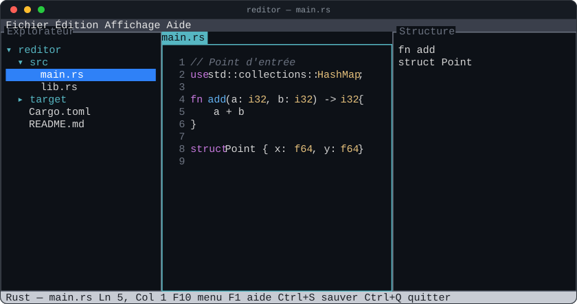

# reditor

Un éditeur de texte façon IDE, entièrement dans le terminal.

`reditor` reprend l'organisation visuelle d'un IDE moderne — explorateur de
fichiers, onglets, panneau de structure du fichier, barre de menu — sans
quitter le terminal.



## Fonctionnalités

- **Explorateur de fichiers** : navigation arborescente au clavier et à la souris.
- **Édition multi-fichiers à onglets** : ouvrir, modifier et sauvegarder
  plusieurs fichiers en parallèle.
- **Coloration syntaxique** par extension de fichier : Rust, Java, Kotlin,
  JavaScript/TypeScript, Bash, Markdown, HTML, CSS, Properties, INI, ainsi
  que JSON, TOML, YAML, Python, C, C++, Go et XML.
- **Panneau Structure** : liste des symboles du fichier actif (fonctions,
  classes, titres, sections…) avec saut direct à la ligne correspondante.
- **Barre de menu** (Fichier / Édition / Affichage / Aide) avec les entrées
  standard, activable au clavier (`F10`) ou à la souris.
- Affichage des panneaux adaptatif (masqués automatiquement si le terminal
  est trop étroit, ou selon le contexte de lancement).

Le détail complet du comportement attendu est décrit dans la
[spécification fonctionnelle](docs/01-reditor-spec.md), et l'architecture
technique dans le [dossier d'architecture technique](docs/02-reditor-dat.md).

## Installation

Prérequis : une chaîne d'outils [Rust](https://www.rust-lang.org/) récente
(édition 2024).

```sh
git clone https://github.com/mcgivrer/reditor.git
cd reditor
cargo build --release
```

Le binaire compilé se trouve dans `target/release/reditor`.

## Utilisation

```sh
reditor                 # ouvre le dossier courant
reditor mon-dossier/    # ouvre un dossier précis (explorateur visible)
reditor mon-fichier.rs  # ouvre directement un fichier (explorateur masqué)
```

### Raccourcis clavier essentiels

| Raccourci | Action |
|---|---|
| `F10` | Ouvrir/fermer la barre de menu |
| `F1` | Aide / À propos |
| `F2` / `F3` / `F4` | Focus explorateur / éditeur / structure |
| `Ctrl+N` / `Ctrl+O` / `Ctrl+S` / `Ctrl+W` | Nouveau / ouvrir / enregistrer / fermer l'onglet |
| `Ctrl+Q` | Quitter (confirmation si modifications non enregistrées) |
| `Ctrl+B` | Afficher/masquer l'explorateur |
| `Ctrl+G` | Aller à une ligne |
| `Ctrl+X` / `Ctrl+C` / `Ctrl+V` | Couper / copier / coller la ligne courante |

La liste complète est détaillée dans la
[spécification fonctionnelle](docs/01-reditor-spec.md#4-raccourcis-clavier--récapitulatif).

## Documentation

- [`docs/HELP.md`](docs/HELP.md) — guide utilisateur (en anglais),
  accessible aussi depuis le logiciel via **Aide > Manuel utilisateur**.
- [`docs/01-reditor-spec.md`](docs/01-reditor-spec.md) — spécification
  fonctionnelle (fonctionnalités, raccourcis, scénarios d'utilisation).
- [`docs/02-reditor-dat.md`](docs/02-reditor-dat.md) — dossier
  d'architecture technique (modules, choix d'implémentation, stratégie de
  test).
- [`docs/features/`](docs/features) — scénarios de comportement au format
  Gherkin.

## Tests

```sh
cargo test --lib          # tests unitaires (syntaxe, buffer, structure...)
cargo test --test features  # scénarios de comportement (Gherkin/cucumber)
cargo clippy --all-targets  # lint
```

## Contribuer

Les contributions sont bienvenues.

1. Créez une branche dédiée à partir de `main` pour votre modification.
2. Gardez les commits ciblés et les messages descriptifs.
3. Ajoutez ou mettez à jour les tests concernés :
   - tests unitaires (`#[cfg(test)]`) pour la logique d'un module,
   - scénarios `.feature` dans `docs/features/` pour un comportement
     observable par l'utilisateur.
4. Avant de proposer votre modification, vérifiez que tout est propre :
   ```sh
   cargo fmt
   cargo clippy --all-targets
   cargo test
   ```
5. Si votre changement modifie ou étend le comportement, mettez à jour la
   [spécification fonctionnelle](docs/01-reditor-spec.md) et, le cas
   échéant, le [DAT](docs/02-reditor-dat.md).
6. Ouvrez une *pull request* décrivant le problème résolu ou la
   fonctionnalité ajoutée, et le raisonnement derrière les choix faits.

Pour un changement de fond (nouvelle dépendance, nouvelle architecture),
ouvrez d'abord une *issue* pour en discuter avant de vous lancer dans
l'implémentation.

## Licence

Distribué sous licence MIT — voir [`LICENSE`](LICENSE).

Copyright (c) 2026 Frédéric Delorme <frederic.delorme@gmail.com>
