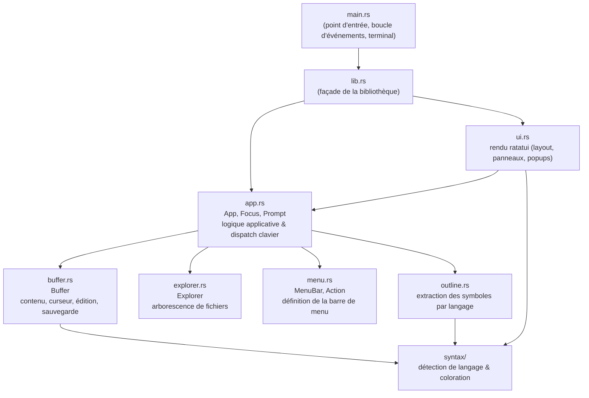
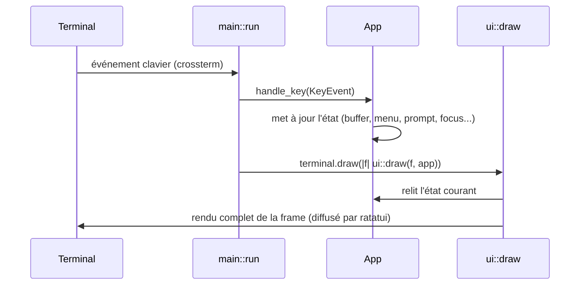

# Dossier d'architecture technique (DAT) — reditor

| | |
|---|---|
| **Produit** | reditor |
| **Langage / plateforme** | Rust (édition 2024), terminal (TUI) |
| **Statut** | En développement actif |
| **Date** | 2026-09-08 |

## 1. Objectif du document

Ce document décrit l'architecture technique de `reditor`, les choix
d'implémentation retenus et leurs justifications, ainsi que la stratégie de
test mise en place. Il complète la
[spécification fonctionnelle](01-reditor-spec.md), qui décrit le produit du
point de vue de l'utilisateur.

## 2. Vue d'ensemble technique

`reditor` est une application Rust en ligne de commande utilisant un rendu
de terminal en mode plein écran (« TUI »). Elle ne dépend d'aucun service
externe ni base de données : tout l'état vit en mémoire pendant l'exécution,
et la seule persistance est la lecture/écriture directe des fichiers édités
sur le système de fichiers.

### 2.1 Dépendances principales

| Crate | Rôle |
|---|---|
| [`ratatui`](https://ratatui.rs) 0.30 | Moteur de rendu du terminal (layout, widgets, buffer de rendu diffé) |
| [`crossterm`](https://docs.rs/crossterm) 0.29 | Backend terminal multiplateforme : mode brut, écran alternatif, lecture des événements clavier |
| [`clap`](https://docs.rs/clap) 4 (derive) | Analyse des arguments de la ligne de commande |
| [`anyhow`](https://docs.rs/anyhow) 1 | Gestion d'erreurs ergonomique (`Result<T, anyhow::Error>`) |

### 2.2 Dépendances de test

| Crate | Rôle |
|---|---|
| [`cucumber`](https://docs.rs/cucumber) 0.23 | Exécution des scénarios Gherkin (`docs/features/*.feature`) |
| `tokio` (macros, rt-multi-thread) | Runtime async requis par `cucumber` |
| `tempfile` | Dossiers de travail isolés et jetables pour chaque scénario de test |

Aucune dépendance de coloration syntaxique externe (type `syntect` ou
`tree-sitter`) n'est utilisée — voir §7.1 pour la justification.

## 3. Architecture générale

Le projet est structuré en **bibliothèque + binaire** : toute la logique
vit dans une crate bibliothèque (`src/lib.rs` et ses modules), et
`src/main.rs` n'est qu'un point d'entrée fin qui l'assemble avec la boucle
d'événements du terminal. Cette séparation permet aux tests d'intégration
(`tests/features.rs`) de piloter directement l'état applicatif (`App`) sans
passer par un terminal réel (voir §8).

### 3.1 Schéma des modules



### 3.2 Arborescence des sources

```
src/
├── lib.rs         # ré-exporte les modules publiquement
├── main.rs        # CLI (clap), init terminal, boucle principale
├── app.rs         # App : état global + dispatch des touches/actions
├── buffer.rs       # Buffer : un fichier ouvert (un onglet)
├── explorer.rs     # Explorer : arborescence de fichiers
├── menu.rs         # MenuBar, MenuDef, MenuItem, Action
├── outline.rs      # extraction de la structure (panneau Structure)
├── syntax/
│   ├── mod.rs      # Language, détection, dispatch, TokenKind, styles
│   ├── rules.rs    # tables de mots-clés par langage (config déclarative)
│   ├── generic.rs  # tokenizer générique façon C (mots-clés/chaînes/nombres/commentaires)
│   ├── markdown.rs # tokenizer dédié Markdown
│   ├── html.rs     # tokenizer dédié HTML/XML
│   └── inilike.rs  # tokenizer dédié INI/Properties/TOML/YAML
└── ui.rs           # rendu ratatui de tous les panneaux et popups

tests/
└── features.rs     # runner cucumber + définitions des étapes Gherkin

docs/
└── features/*.feature   # scénarios de comportement (BDD)
```

## 4. Description des modules

### 4.1 `app.rs` — État applicatif et dispatch

`App` est la structure centrale : elle regroupe la liste des onglets
ouverts (`tabs: Vec<Buffer>`), l'onglet actif, l'état de l'explorateur, du
menu, des panneaux (`show_explorer`, `show_outline`), du focus courant
(`Focus::{Explorer, Editor, Outline}`), d'une éventuelle invite de saisie
modale (`Option<Prompt>`) et d'une éventuelle fenêtre « À propos ».

`App::handle_key(KeyEvent)` est le point d'entrée unique de traitement du
clavier. Il applique un ordre de priorité strict à chaque frappe :

1. Fenêtre « À propos » ouverte → consomme la touche pour la fermer.
2. Invite de saisie active (`prompt`) → routage vers `handle_prompt_key`.
3. Menu actif (`menu.active`) → routage vers `handle_menu_key`.
4. Raccourcis globaux (F1, F10, combinaisons Ctrl+…).
5. Sinon, routage selon le focus courant (`Focus::Explorer` /
   `Focus::Editor` / `Focus::Outline`).

`App::execute_action(Action)` centralise l'exécution des actions du menu
(§4.3) : elle est appelée aussi bien depuis la sélection d'une entrée de
menu que depuis son raccourci clavier direct, garantissant un comportement
identique dans les deux cas (un seul chemin de code par action).

### 4.2 `buffer.rs` — Contenu d'un onglet

`Buffer` représente un fichier ouvert : son chemin (`Option<PathBuf>`, absent
pour un fichier « sans titre »), son contenu (`lines: Vec<String>`), la
position du curseur, le décalage de défilement, l'état modifié, le langage
détecté et l'état de coloration précalculé par ligne
(`highlight_states: Vec<LineHighlightState>`, voir §5.2).

Toutes les opérations d'édition (insertion, retour à la ligne, suppression,
déplacement du curseur, couper/copier/coller de ligne) sont des méthodes de
`Buffer`, indépendantes de tout code d'interface — elles sont donc testables
unitairement sans terminal (voir `buffer::tests` et `docs/features/edition.feature`).

Un onglet sans fichier réel sur disque (ex. le manuel utilisateur, voir §4.1
et `docs/HELP.md`) porte un `virtual_name: Option<String>` utilisé par
`display_name()` à défaut de `path`, et se construit via
`Buffer::from_content`, qui reçoit son contenu déjà en mémoire (embarqué
dans le binaire à la compilation via `include_str!`) plutôt que de le lire
sur disque.

### 4.3 `menu.rs` — Définition déclarative du menu

Le menu est une donnée statique (`MenuBar::new()`) : une liste de
`MenuDef` (un menu déroulant nommé) contenant chacun des `MenuItem`
(libellé, raccourci affiché, `Action` associée — ou `None` pour un
séparateur). `Action` est une énumération fermée des opérations
déclenchables depuis le menu ; `App::execute_action` en fournit
l'unique implémentation. `MenuBar` porte aussi l'état de navigation
courant (menu/entrée sélectionnés, actif ou non), avec des méthodes de
déplacement qui sautent automatiquement les séparateurs.

### 4.4 `explorer.rs` — Arborescence de fichiers

`Explorer` maintient une liste **aplatie** (`Vec<ExplorerEntry>`) de
l'arborescence visible, chaque entrée portant sa profondeur d'indentation.
Déplier un dossier insère ses enfants triés (dossiers avant fichiers, puis
ordre alphabétique) juste après lui dans le vecteur ; le replier retire la
plage contiguë de ses descendants. Ce choix (plutôt qu'un arbre de nœuds
imbriqués) simplifie grandement le rendu (une simple liste indentée) et la
navigation (déplacement d'index), au prix d'un recalcul de plage O(n) lors
du pliage — largement suffisant pour des arborescences de projet typiques.

### 4.5 `outline.rs` — Extraction de la structure

`extract_outline(lines, language) -> Vec<OutlineItem>` distribue vers une
fonction d'extraction dédiée par famille de langage (voir la table du §3.5
de la spécification fonctionnelle). Chaque extracteur applique des règles
lexicales simples ligne par ligne (préfixes de mots-clés, indentation) —
suffisant pour un panneau de navigation, sans nécessiter un analyseur
syntaxique complet.

### 4.6 `syntax/` — Détection de langage et coloration

Voir §5 (section dédiée, le moteur de coloration étant la partie la plus
substantielle du projet).

### 4.7 `ui.rs` — Rendu

Toute la fonction de rendu (`ui::draw(frame, app)`) est **pure vis-à-vis de
l'état** : à chaque frame, elle relit l'état courant de `App` et redessine
entièrement l'interface (ratatui gère lui-même la diffusion différentielle
vers le terminal réel, §6.2). Le découpage se fait en deux temps :

1. **Mise en page** (`Layout` verticale puis horizontale) : ligne de menu
   (hauteur fixe 1), zone principale (extensible), barre de statut (hauteur
   fixe 1) ; puis, dans la zone principale, colonnes explorateur (largeur
   fixe, conditionnelle) / éditeur (extensible) / structure (largeur fixe,
   conditionnelle).
2. **Rendu des popups** (menu déroulant, invites de saisie, « À propos »),
   dessinés **après** tout le reste et **ancrés sous la ligne de menu**
   (jamais sur l'écran entier), afin que la barre de menu reste toujours
   visible en haut de l'écran quelle que soit la taille du terminal — voir
   §7.4 pour l'historique de ce choix.

## 5. Moteur de coloration syntaxique

### 5.1 Détection du langage

`syntax::detect_language(path: &Path) -> Language` associe une extension de
fichier (ou, à défaut, un nom de fichier exact comme `Makefile`) à une
valeur de l'énumération `Language`. Cette détection est ré-appliquée après
un « Enregistrer sous... » vers un nouveau chemin.

### 5.2 Coloration ligne par ligne avec état inter-lignes

`highlight_line(line, language, state: &mut LineHighlightState)` découpe une
ligne en fragments `(TokenKind, String)`. Certaines constructions
s'étendent sur plusieurs lignes (commentaire de bloc `/* ... */`, bloc de
code Markdown ```` ``` ````, commentaire HTML `<!-- -->`) : `LineHighlightState`
capture cet état (`in_block_comment`, `in_code_fence`, `in_html_comment`) et
est enfilé de ligne en ligne.

Pour éviter de retokeniser tout le fichier à chaque frame, `Buffer` précalcule
et mémorise, pour **chaque** ligne, l'état *au début* de cette ligne
(`recompute_highlight_states`, appelé après chaque modification du buffer).
Le rendu (`ui::draw_center`) n'a alors besoin de tokeniser que les lignes
réellement **visibles** à l'écran, en repartant de l'état déjà connu pour la
première d'entre elles — coût proportionnel à la hauteur du terminal, pas à
la taille du fichier.

### 5.3 Deux familles de tokenizers

- **`generic::tokenize`** : un tokenizer unique, paramétré par une
  configuration déclarative par langage (`rules.rs` : mots-clés, types,
  booléens, marqueurs de commentaire ligne/bloc, guillemets de chaîne,
  éventuel « sigil » de variable façon shell). Il couvre tous les langages
  de type C (Rust, Java, Kotlin, JavaScript/TypeScript, C, C++, Go),
  Bash, Python, CSS et JSON (ces deux derniers avec un post-traitement
  `recolor_keys` qui repasse en couleur « clé » une chaîne suivie de `:`).
- **Tokenizers dédiés** pour les formats dont la syntaxe ne se prête pas au
  modèle « mots-clés + chaînes + commentaires » : `markdown.rs` (titres,
  gras, italique, code en ligne, liens, blocs de code), `html.rs` (balises,
  attributs, commentaires), `inilike.rs` (sections, paires clé/valeur,
  commentaires — réutilisé pour Properties, INI, TOML et, avec une
  variante, YAML).

Chaque fragment produit porte un `TokenKind` (Keyword, Type, String,
Number, Comment, Function, Tag, AttrName, Heading, …), auquel `style_for`
associe un style ratatui (couleur, gras, italique…) — un point unique de
définition de la palette de couleurs.

## 6. Boucle principale et cycle de rendu

### 6.1 Séquence d'une frappe clavier



`main::run` est une boucle simple : dessiner, attendre un événement (avec
un délai de sondage de 200 ms), le transmettre à `App::handle_key` s'il
s'agit d'une frappe, puis recommencer jusqu'à `app.should_quit`. Le mode
brut du terminal (`crossterm::terminal::enable_raw_mode`) désactive
l'écho, le mode canonique et la génération de signaux pour Ctrl+C/Ctrl+Z,
qui sont ainsi reçus comme des événements clavier ordinaires (utilisés par
exemple pour Ctrl+C = copier la ligne).

### 6.2 Rendu différentiel

`ratatui` maintient en interne un tampon de la frame précédente et ne
transmet au terminal que les cellules qui ont changé. `reditor` n'a donc pas
à optimiser lui-même son rendu : `ui::draw` peut se permettre de redessiner
la totalité de l'interface à chaque frame sans coût de performance notable.

### 6.3 Restauration du terminal

`main.rs` installe un *panic hook* qui restaure le terminal (désactive le
mode brut, quitte l'écran alternatif) avant de propager le panic, afin
qu'un plantage inattendu ne laisse pas le terminal de l'utilisateur dans un
état inutilisable.

## 7. Choix d'implémentation et alternatives envisagées

### 7.1 Un tokenizer maison plutôt que `syntect` ou `tree-sitter`

**Choix retenu** : un moteur de coloration écrit spécifiquement pour ce
projet (§5), sans dépendance externe de coloration syntaxique.

**Alternatives envisagées** :
- `syntect` (grammaires Sublime Text) : bibliothèque mature, mais dont le
  jeu de grammaires embarqué ne couvre pas nativement tous les langages
  demandés (Kotlin, Properties…) et impose un poids de dépendance et un
  temps de compilation significatifs pour un besoin de coloration simple
  en environnement terminal.
- `tree-sitter` : analyse syntaxique incrémentale de haute qualité, mais
  nécessite une grammaire compilée par langage (dépendances C
  supplémentaires) — disproportionné pour un panneau de coloration de
  terminal.

**Justification** : le besoin exprimé (coloration lisible par extension de
fichier, sans exigence de correction syntaxique absolue) est couvert de
façon largement suffisante par un tokenizer lexical simple, en gardant la
maîtrise complète du rendu, un temps de compilation minimal et un contrôle
direct sur chaque langage ajouté.

### 7.2 `ratatui` + `crossterm` plutôt qu'une autre pile TUI

Choix standard et le plus actif de l'écosystème Rust pour les interfaces en
mode texte ; `crossterm` apporte un support multiplateforme (Linux/macOS/
Windows) du mode brut et des événements clavier.

### 7.3 Structuration bibliothèque + binaire

Décidée au moment d'ajouter les tests de comportement Gherkin (§8) : un
test d'intégration ne peut accéder qu'à l'API publique d'une crate ; il
fallait donc que `App` et les modules associés soient exposés par une
bibliothèque plutôt qu'enfouis dans un binaire. Ce découpage n'a aucun coût
d'exécution (le binaire ne fait qu'appeler la bibliothèque) et clarifie par
ailleurs la frontière entre logique applicative et code d'entrée de
processus.

### 7.4 Ancrage des popups sous la barre de menu

Un bug a été identifié où, sur un terminal de très petite hauteur, une
fenêtre modale centrée (« À propos », invite de saisie) pouvait
recouvrir la ligne de menu. Plutôt que de centrer les popups sur l'écran
entier, ils sont désormais centrés sur la zone **sous** la barre de menu
uniquement — garantissant que celle-ci reste toujours visible, y compris
sur un terminal de quelques lignes seulement (vérifié jusqu'à 5 lignes).

### 7.5 Explorateur masqué par défaut sans dossier ouvert explicitement

Décision fonctionnelle : lancer `reditor` sur un simple fichier (ou sans
argument) ne présuppose pas que l'utilisateur souhaite naviguer dans le
système de fichiers ; l'explorateur ne s'affiche alors pas par défaut, mais
reste accessible en un raccourci (Ctrl+B) — évitant d'imposer un panneau
inutile tout en gardant la fonctionnalité disponible.

## 8. Stratégie de test

### 8.1 Tests unitaires

Chaque module contenant une logique non triviale porte ses propres tests
(`#[cfg(test)] mod tests`) : détection de langage, tokenisation par
langage, extraction de structure, découpage de ligne (`insert_newline`).
Exécution : `cargo test --lib`.

### 8.2 Tests de comportement (BDD / Gherkin)

**Choix retenu** : scénarios Gherkin (`docs/features/*.feature`) exécutés
par la crate `cucumber`, avec des étapes qui pilotent **directement une
instance de `App`** (pas de terminal réel, pas de processus séparé) —
voir `tests/features.rs`. Les scénarios impliquant la souris rendent
toutefois l'interface une fois dans un `ratatui::backend::TestBackend` en
mémoire avant de simuler un clic, seul moyen déterministe de connaître les
zones cliquables (`App::hitboxes`) sans dupliquer la logique de layout de
`ui::draw` — cela reste un backend de test, pas un terminal ni un processus
réel.

**Alternative envisagée et écartée pour l'essentiel des scénarios** : bout
en bout via un pseudo-terminal réel (crate `portable-pty`) et un émulateur
de terminal (crate `vt100`) pour vérifier le rendu affiché. Cette approche,
plus fidèle à l'usage réel, a été jugée trop lente et fragile (délais
d'attente, assertions sur du texte rendu) pour couvrir la logique métier ;
elle a néanmoins été utilisée **manuellement**, hors suite automatisée
(scripts Python `pty` + `pyte`), pour diagnostiquer des problèmes de rendu
réels au fil du développement (par exemple le bug de recouvrement de la
barre de menu, §7.4).

Chaque scénario dispose d'un dossier temporaire isolé (`tempfile::tempdir`),
détruit à la fin du scénario, pour ne jamais interférer avec le dépôt du
projet ni les autres scénarios. Exécution : `cargo test --test features`.

État actuel : 7 fichiers `.feature`, 44 scénarios, 181 étapes, tous
passants.

## 9. Limitations connues et dette technique

- La recoloration d'un buffer est recalculée pour l'ensemble du fichier à
  chaque modification (`Buffer::recompute_highlight_states`) ; sans impact
  perceptible aux tailles de fichier usuelles, une future optimisation
  consisterait à ne recalculer qu'à partir de la ligne modifiée.
- Pas d'undo/redo, pas de recherche ni de remplacement — ces fonctionnalités
  n'ont pas été demandées à ce stade.
- Pas de redimensionnement des panneaux ni de barre de défilement
  cliquable/glissable à la souris ; pas de menu contextuel (clic droit).
- L'explorateur ne propose aucune opération d'écriture sur le système de
  fichiers (créer/renommer/supprimer).
- Aucun test automatisé ne couvre le rendu visuel réel (uniquement testé
  manuellement) ; un futur chantier pourrait introduire une suite
  end-to-end ciblée (§8.2) pour quelques invariants visuels critiques.

## 10. Pistes d'évolution

- Undo/redo (pile de modifications sur `Buffer`).
- Recherche/remplacement dans le buffer courant.
- Redimensionnement des panneaux et barre de défilement cliquable/glissable
  à la souris ; menu contextuel (clic droit).
- Opérations de fichier depuis l'explorateur (nouveau fichier/dossier,
  renommage, suppression).
- Coloration incrémentale (ne retokeniser que les lignes affectées par une
  modification).
